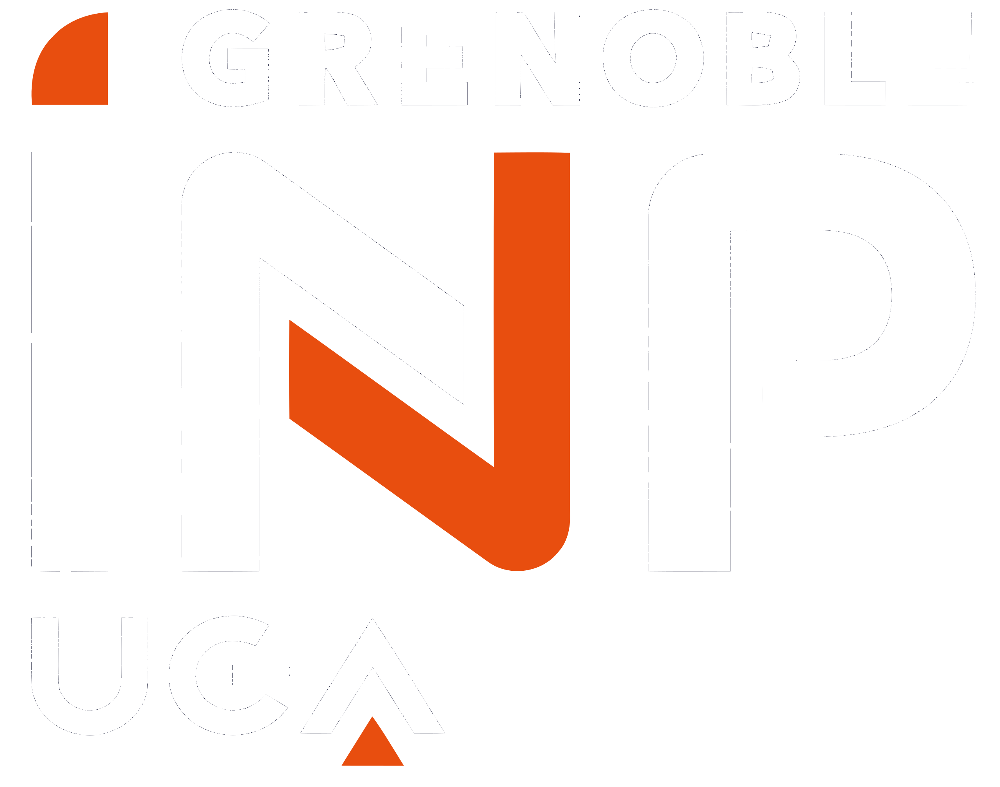
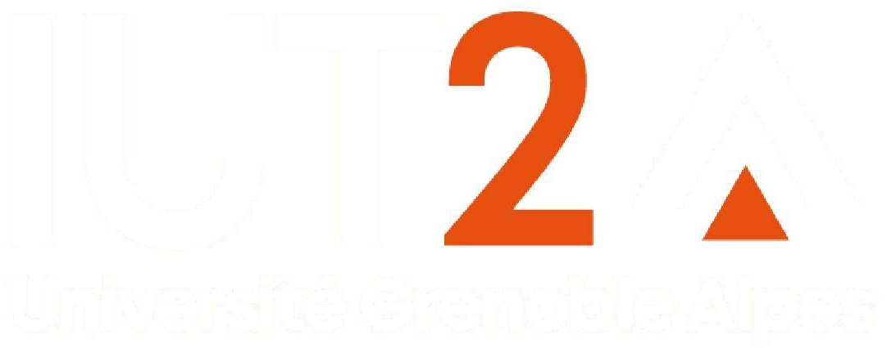

## 2023 - 2024

Contract teacher at <a href="https://ense3.grenoble-inp.fr/" style="text-decoration: none">Grenoble INP - ENSE3</a>.

* Introduction to machine learning course
* Digital signal processing course
* Project "making a keyboard from a board"
  

## 2022 - 2023

Contract teacher at <a href="https://ense3.grenoble-inp.fr/" style="text-decoration: none">Grenoble INP - ENSE3</a>.

* Introduction to machine learning course
* Digital signal processing course
* Project "making a keyboard from a board"
* Practical sessions on sensors and information processing
 

## 2020 - 2021

Contract teacher at the <a href="https://iut2.univ-grenoble-alpes.fr/" style="text-decoration: none">IUT2</a> of Grenoble.

* Tutoring in mathematics, physics and programming for 1st year students
