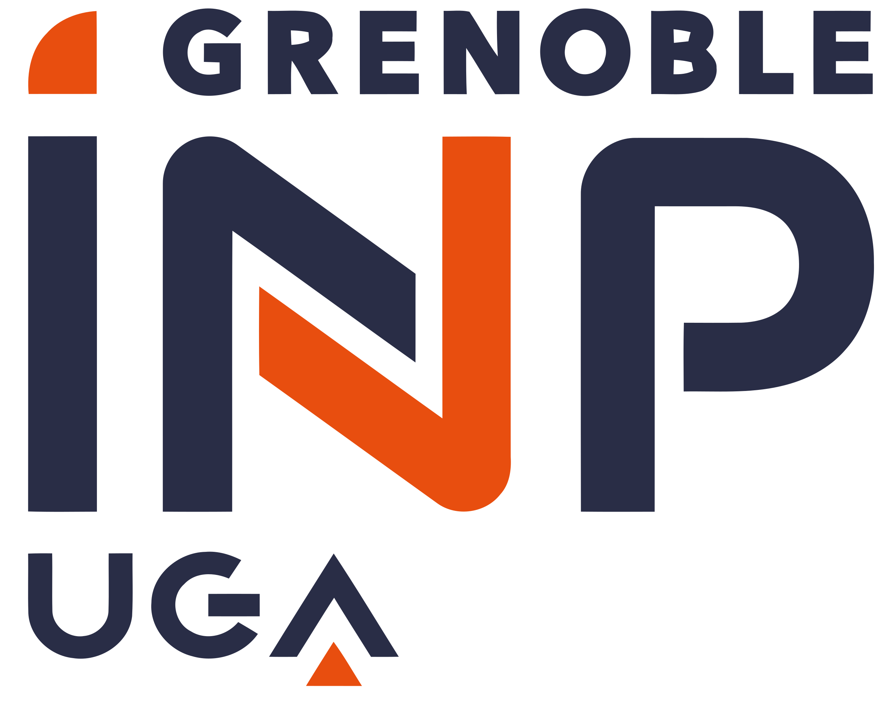
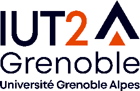

## 2022 - 2023

Contract teacher at [Grenoble INP - ENSE3](https://ense3.grenoble-inp.fr/).

* Introduction to machine learning (10h) and practical sessions (24h)
* Digital signal processing (10h) and practical sessions (8h)
* Practical sessions of sensors and information processing (8h)

## 2020-2021

Contract teacher at the [IUT2](https://iut2.univ-grenoble-alpes.fr/) of Grenoble.

* Tutoring in mathematics, physics and programming for 1st year students
