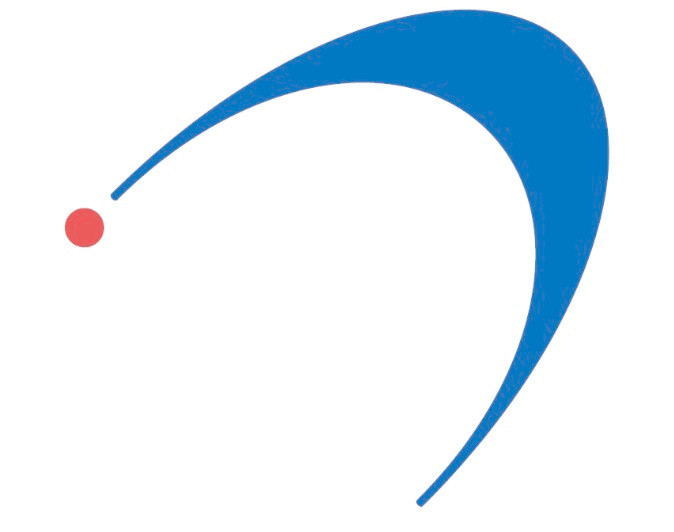
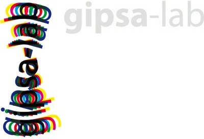
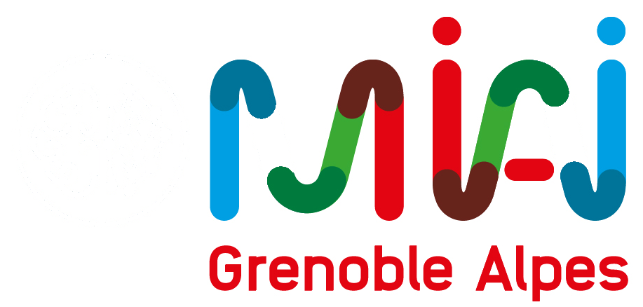

Welcome to my personnal webpage!

I am currently a PHD student at [IRAM](https://iram-institute.org/) and at [GIPSA-Lab](https://www.gipsa-lab.grenoble-inp.fr/) in the [SigmaPhy](https://www.gipsa-lab.grenoble-inp.fr/equipe/sigmaphy) team in Grenoble.

I'm specialized in signal processing and data science. I apply this knowledge in an interdisciplinary work with astrophysicists in order to better understand and model the interstellar medium, particularly the Orion molecular cloud complex.

  

  

  

## Research interests

Physical modeling, Machine learning, Signal processing, Statistics
