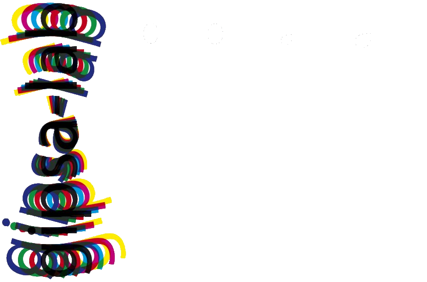

Welcome to my personnal webpage!

I'm a PhD in astrophysics with an engineering background in signal processing and data science.

During my thesis, I took part in an interdisciplinary collaboration between astrophysicists and researchers in statistics and data science, namely the <a href="https://www.iram.fr/~pety/ORION-B/" style="text-decoration: none">ORION-B consortium</a>, aimed at improving our understanding of the interstellar medium, using the Orion B giant molecular cloud as a template. I have contributed to the introduction of deep learning and information theory tools for Large Program data denoising, model emulation, and astrophysical parameter inference.

  

<em>The Orion B GMC seen in optical (credits: Leonardo Orazi) and as a composition of three millimeter-wave lines of CO isotopologues (credits: ORION-B collaboration).</em>

I carried out this thesis at <a href="https://iram-institute.org/" style="text-decoration: none">IRAM</a> and at <a href="https://www.gipsa-lab.grenoble-inp.fr/" style="text-decoration: none">GIPSA-lab</a> in the <a href="https://www.gipsa-lab.grenoble-inp.fr/equipe/sigmaphy" style="text-decoration: none">SigmaPhy</a> team, in Grenoble (France) from 2021 to 2024. This thesis was co-funded by IRAM and MIAI@Grenoble Alpes.

  

  

  

## Research interests

* Physical modeling
* Machine learning
* Signal processing
* Applied statistics
